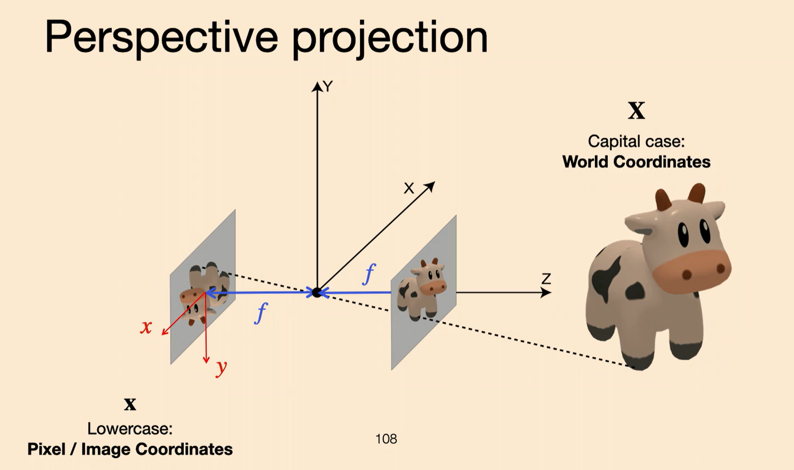
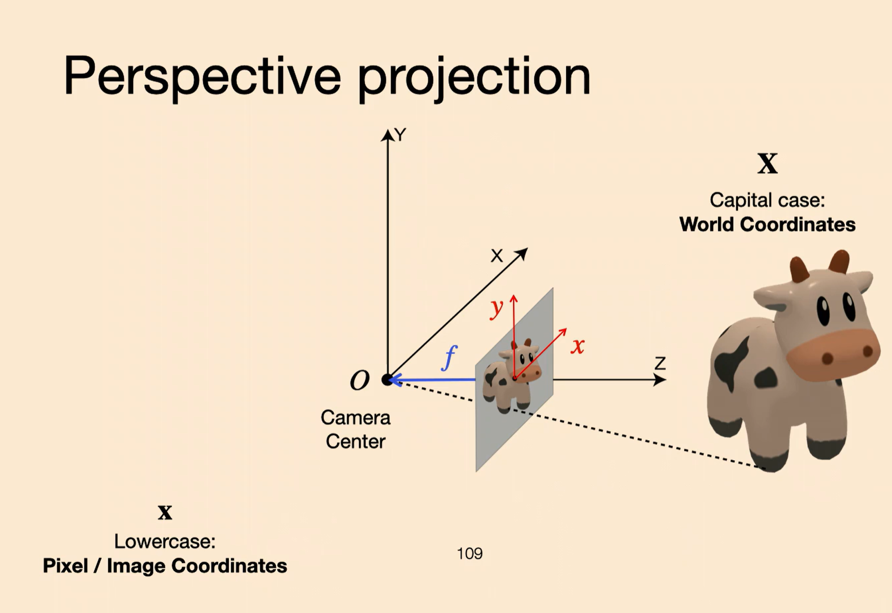
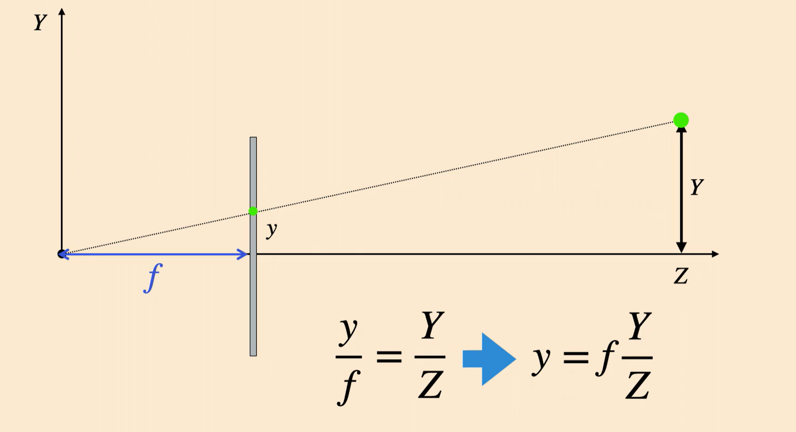
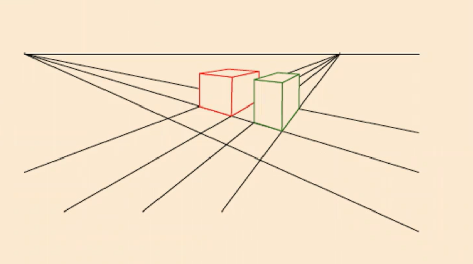
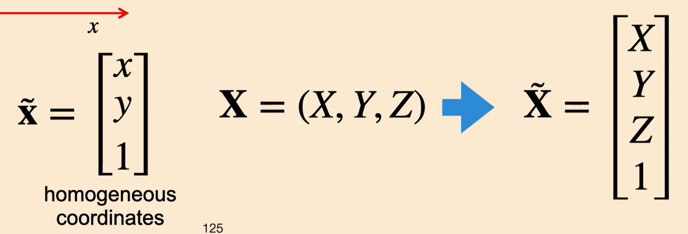
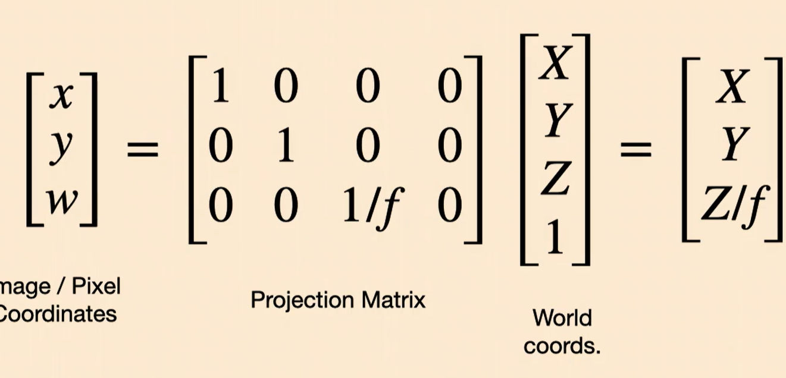
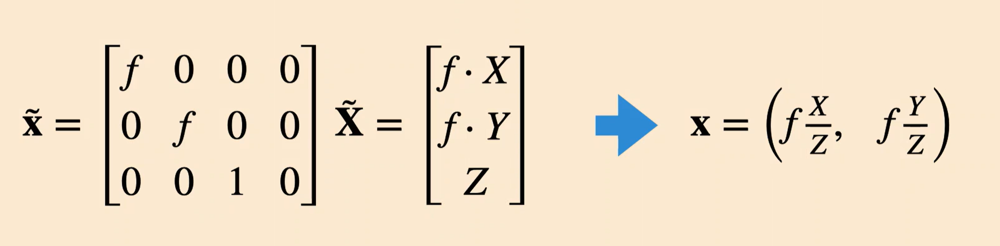
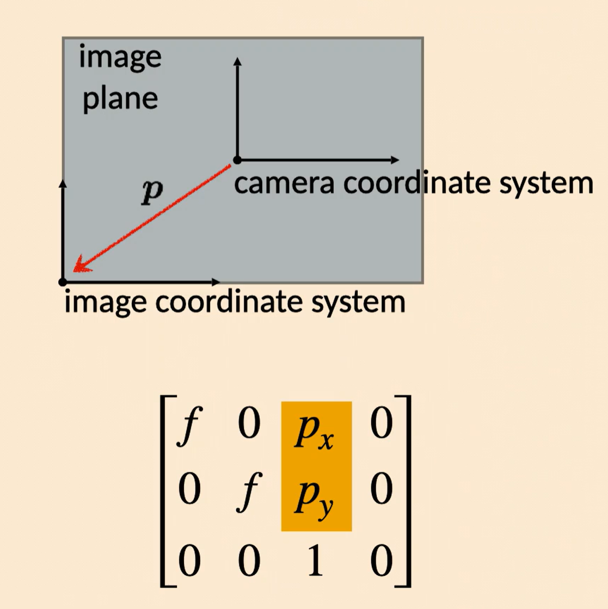

# Image Formation

Week 1, Thursday
## Pinhole Cameras
-Why don't you see an image when you hold up a piece of paper?
    - Each point in space reflects in all directions, which get spread out across the paper
    - Conversely, each point on the paper gets light from multiple points in the scene.
- Pinhole camera light in such that each point on the image corresponds to a point from an object
- Get an image on the other side
- Tradeoff between brightness and sharpness
### Derivation

- Establish 3D camera system.
- center = pinhole cetner.
- z = distance from pinhole center
- x and y are up and side
- right handed in real-world space
- f = distance from pinhole to image plane

We can think of the unflipped image instead:

Can use similar triangles:

Note that **depth** is $$Z$$, not the ray length (the hypotenuse).

$$
\mathbf{x} = (x,y) = (X,Y) \cdot \frac{f}{Z}
$$

Where $$(x,y)$$ are the image/pixel coordinates, and $$(X,Y)$$ are the world coordinates.

### Properties Preserved
- Lines that are straight in 3D are straight in 2D
- Incidences - lines that meet in 3D will meet in 2D
- Angles and lengths are distorted. Right angled tables are different
- Parallel lines will not be there, there will be vanishing points (e.g.) railroad tracks.

#### Example - a line.
$$
X(t) = X_0 + at
$$
$$
Y(t) = Y_0 + bt
$$
$$
Z(t) = Z_0 + ct
$$
After computing $x$ and $y$ in pixel space and taking $$t \rightarrow \infty$$, we see that we get points in image space as 

$$
\frac{fa}{c}
$$

$$
\frac{fb}{c}
$$
Which does not depend on $X_0$, or the 'initial point' on the line. All parallel lines intersect at the vanishing point, it does not matter the 'offset' of the line, just the 'slope'

Unless the lines are parallel to the image plane, or $$c=0$$, parallel lines will remain parallel. Lines that are parallel to the image plane will either have a single intersection or be parallel.

Diffusion models also don't always have perspective geometry.

### Homogeneous Coordinates
The $(X,Y,Z)$ to $(x,y)$ mapping is not linear.

Lets try having

And, all points are equivalent up to scalar multiplications.

Now, let's look for a transformation from 3D Homogenous coordinates to 2D image pixel coordinates:

Intrinsics Matrix:

We should also have translations in x-y sspace 

