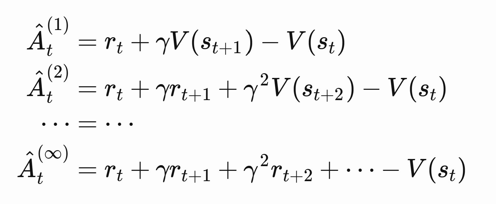
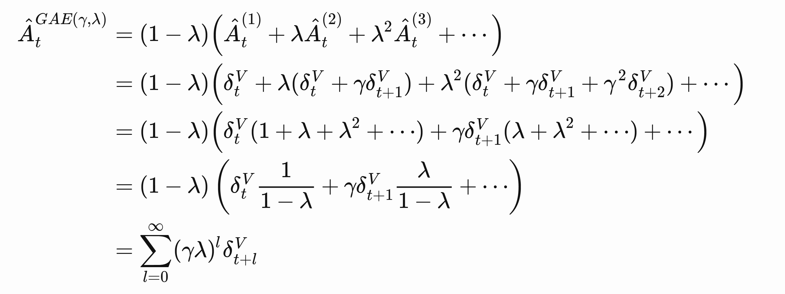

# Generalized Advantage Estimation
Define this:

The first term is actor critic, next state minus current state
The last term is pure policy gradient, with value function as baseline.

GAE takes a weighted sum between all these terms:

$\lambda$ thus determines the bias-variance tradeoff. Policy gradient has high variance. One step actor critic has high bias due to reliance on value function, but low variance since we are only considering values between $t$ and $t+1$.

