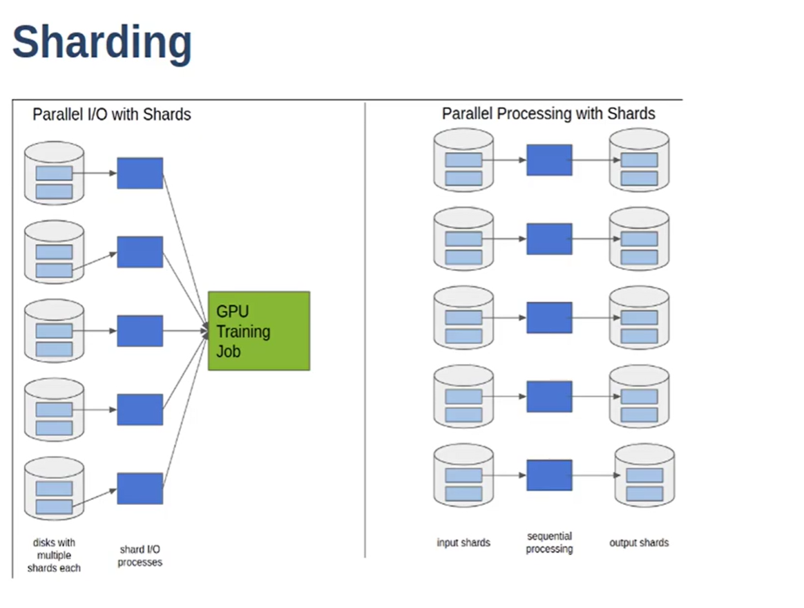

# Large Scale Deep Learning

- Distributed Storage Systems, network communications
- Use rotational drives instead of NVMe cheaper
- node-to-node communications become an issue.
- Storage is on distributed systems, this is only reachable over network.
- Weight Sync is done using pytorch
- Need Fast I/O - this is the hardest part.
- Read from Disk -> Memory -> Network card -> compute node network card -> memory -> GPU
- Some parts are scalable, other's aren't. Can't just double memory bus's bandwidth.
- optimal = 100% utilization of most expensive part (GPU)
- GPUs consume 200-1000 MB per second.
- nvidia-smi shows gpu utilization. 
- smaller datasets can fit on NVMe drive, which transfers at 3 GB/second, easily keeping 4 desktop GPUs busy.
- Example: 100 TB, 16 GPUs, 200 MB/s/GPU
    - NVMe:
        - $35,000 alone for storage
        - 300 GB/s
        - cant fit in one machine
    - Rotational
        - 8 TB, 16, $320
        - 3.2 GB/s bandwidth
        - can fit into 1-2 machines
## Key Principles
- Sequential I/O
- Pipelining
- Sharding

### Sequential IO
- PyTorch, file-based - access samples in random order.
    - random access requires moving the disk head, loading, moving again.
    - 20 MB per second (on rotational)
- Sequential IO
    - Make a .tar archive of all the examples in the dataset
    - reads are sequential.
    - IterableDatasets
    - 200 MB/s read speeds (on rotational)
    - in-memory shuffle buffer:
        - while True:
            - sample = next(dataset)
            - index = randint(0, len(buffer)-1)
             - sample, buffer[index] = buffer[index], sample
        - Basically, the sample gets read from the buffer, and the buffer at index get replaced
        by the previous sample.
    - better for network storage
    - TFRecord/tf.Example, Google GFS, Hadoop, FORTRAN
### Pipelining
- make one request, many examples flow
- possible with sequential storage.
- Caching? Doesn't help in deep learning, since we iterate through the entire epoch

### Sharding
- 100 TB file, read sequentially. 200 MB/s IO
- All reading is sequential.
- Sharding - 100 TB dataset, split it up into 10,000 shards of 10 TB each.
- access shards randomly - read shards in random order, read each shard sequentially with in memory buffer for shuffling.

### Three Tiers
- Dataservers send data to CPU nodes, which do preprocessing. 
These are then sent to the GPU.
- RDMA based transfers from CPU to GPU. stops PCI bus as bottleneck.
- combine the middle tier into the storage system (AIStore, NVIDIA).
- HDFS can be difficult to configure, it was designed for big data.

Last Reviewed: 5/1/25