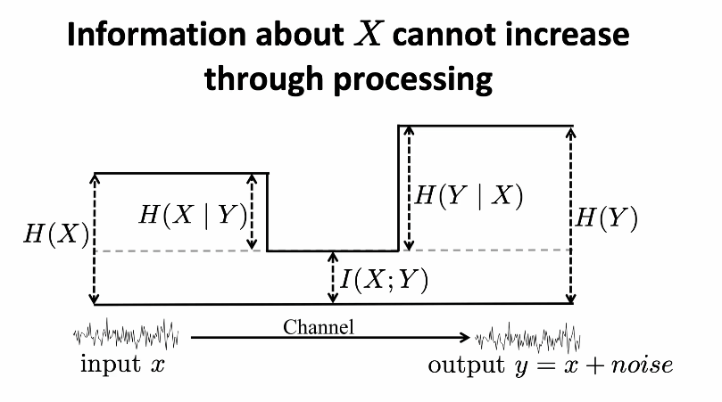
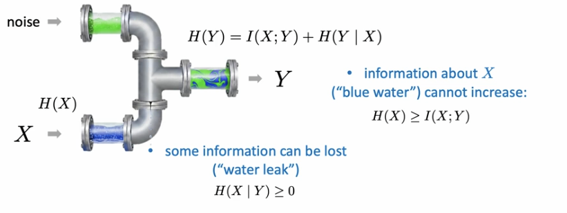

# Mutual Information

E_p(x,y) log (p(x,y)) / p(x) p(y)

or

KL(p(x,y) || p(x)p(y))

it's symmetric

information provided about one variable about another

MI is less than entropy of either varaible
MI = entropy1 + entropy2 - joint entropy
MI >= 0

processing cannot increase information

water pipe analogy

neural networks can only lose information

X -> Y -> Z

MI(X,Y) >= MI(X,Z). pipe analogy works here too.

### Supervised Learning
MI between input and GT label is greater than or equal to MI between pred label and GT label (data  processing inequality - MI only goes down after processing)

cross entropy loss encourages retaining MI about class label

can also be used in contrastive learning
- positive pairs are sampled from joint, negative pairs are from product of marginals
(skipped)

contrastive learning - maximizing MI between image an augmented views

Last Reviewed: 10/26/2025
