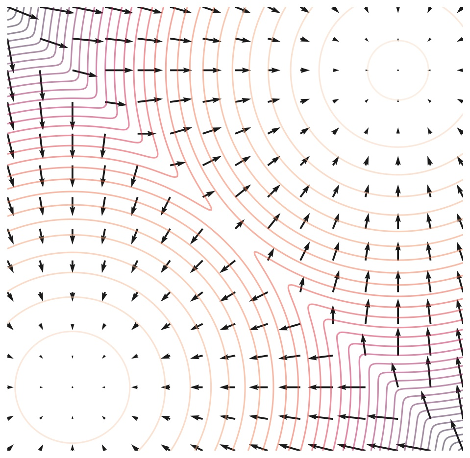

# Score Functions

## Motivation

Given datapoints $\mathbf{x_1}, \ldots , \mathbf{x}_N$ independently[^1] drawn from an underlying distribution $p(\mathbf{x})$, we would like to model the data distribution $p(\mathbf{x})$. 

[^1]: Note that datapoints are assumed to be independent, i.e., the generation of a datapoint $\mathbf{x_i}$ does not influence the generation of another datapoint $\mathbf{x_j}$.

We can parametrize the disribution as $p_\theta(\mathbf{x})$, and try maximizing the probability of observing all data points, which is

$$
p_\theta(\mathbf{x_1}, \ldots , \mathbf{x}_N) = \prod_{i=1}^N p_\theta(\mathbf{x_i}).
$$

This is equivalent to maximizing the log probability:

$$
\log p_\theta(\mathbf{x_1}, \ldots , \mathbf{x}_N) = \sum_{i=1}^N \log(p_\theta(\mathbf{x_i}))
$$

If we do not require $p_\theta(\mathbf{x})$ to be a valid probabilty density function (that integrates to $1$), the values of $p_\theta(\mathbf{x})$ will become arbitrarily large (and can also do so even if we impose the constraint that it integrates to $1$, depending on the parametrization). However, ensuring this density function integrates to one is typically not tractable.

## Definition

The score function is the gradient of the log of the probability density function, or

$$
\nabla_\mathbf{x} \log(p(\mathbf{x}))
$$

{width="400" height="400" style="display: block; margin: 0 auto"}

*Score function of a mixture of 2 Gaussians*

## Avoiding the Normalizing Constant
Modeling the score function does not require knowing the normalizing constant that results in $p(\mathbf{x})$ integrating to 1.

For instance, we can model any probability distribution as 
$$
\frac{e^{-f_\theta(\mathbf{x})}}{Z_\theta}
$$
Where $Z_\theta$ is a normalizing constant, which depends on $\theta$.

Taking the log of this PDF results in

$$
\log{e^{-f_\theta(\mathbf{x})}} - \log{Z_\theta} = 
-f_\theta(\mathbf{x})- \log{Z_\theta}
$$

And taking the gradient of this results in the second term vanishing:

$$
-\nabla_\mathbf{x} f_\theta(\mathbf{x}) - \nabla_\mathbf{x} \log{Z_\theta} =
-\nabla_\mathbf{x} f_\theta(\mathbf{x}) = s_\theta (\mathbf{x})
$$

The normalizing constant imposes restrictive architectural choices (like invertible layers in normalizing flows) or discretization (like outputting a softmax distribution). However, fitting $s_\theta$ does not require considering the normalizing constant, which allows for more flexibility. In fact, $s_\theta(\mathbf{x})$ only has the constraint that it should have correct input and output dimensionality, namely, both should equal the dimensionality of $\mathbf{x}$.

## Optimization
We can attempt to fit the score function by minimizing 

$$
E_{p(\mathbf{x})}\left[ \lVert \nabla_\mathbf{x} \log(p_\theta(\mathbf{x})) - s_\theta (\mathbf{x}) \rVert^2 _2 \right]
$$

How do we know the ground truth score function? There is a technique called **score matching**.

## Langevin Sampling
Langevin sampling allows you to sample from a distribution given its score function. First, we draw from an arbitrary distribution:
$$
x_0 \sim \pi(\mathbf{x})
$$
Then we iteratively perform "noisy gradient ascent":
$$
x_{i+1} = x_{i} + \epsilon \nabla_x \log (p(\mathbf{x})) + \sqrt{2 \epsilon} z_i, \quad i = 0, \ldots, K
$$
Where $z_i \sim \mathcal{N}(0,I)$.

As the step size $\epsilon \rightarrow 0$, and the number of steps $K \rightarrow \infty$, this will result in a sample from $p(\mathbf{x})$.

{width="400" height="400" style="display: block; margin: 0 auto"}
*Using Langevin Dynamics to sample from a mixture of 2 Gaussians.*

Instead of using the ground-truth score function, we can plug in our estimate for the score function in order to generate samples.

##### Observation from Mason
Using the log allows for *larger* absolute scores near the edges of the Gaussian, since the numbers are smaller there, so the logarithm is large. Thus, scores are larger the further away we are from the mean of the Gaussian, which is what we want, since we want to jump further.

## Adding Noise
### Problems with Naive Langevin Sampling

Modeling the score function naively is difficult, because our estimates of the score function are inaccurate in low-density regions.

Note that

$$
\mathbb{E}_{p(\mathbf{x})}\left[ \lVert \nabla_\mathbf{x} \log(p_\theta(\mathbf{x})) - s_\theta (\mathbf{x}) \rVert^2 _2 \right] =
\int p(\mathbf{x}) \lVert \nabla_\mathbf{x} \log(p_\theta(\mathbf{x})) - s_\theta (\mathbf{x}) \rVert^2 _2  d \mathbf{x}
$$
So the distance between the score and our estimate are downweighted in regions where $p(\mathbf{x})$ is small (low density regions). (In practice, the expectation is computed by sampling real data, so the score estimate is inaccurate where we have little data).

This complicates Langevin sampling, since $\mathbf{x}_0$ (the first sampling step) usually starts in a low-density region according to the data distribution (it is usually just noise).

### Mason/Mert's Insights:

#### Adding two random variables
1. Recall from [Brad Osgood's course](https://see.stanford.edu/course/ee261) that adding two random variables $Z = X + Y$ results in a distribution that is a *convolution* of the distributions of $X$ and $Y$.

2. By adding noise to our data, we are essentially *smoothing* the data distribution with a *gaussian kernel*.

3. This smoothing can be thought of as *increasing the support* of the distribution. Think about it - if we add lots of noise, almost anything can arise with some probability.

4. In addition, we can represent our data distribution as a set of discrete samples, or impulse functions at each datapoint. The sifting theorem means that the noisy data distribution can be represented as a **mixture of Gaussians**.

#### Score function of a Gaussian

1. Note that the score function of a Gaussian is linear:

$$
\nabla \log \left[\exp\frac{-(x-\mu)^2 }{\sigma^2} \right] = \frac{-2(x - \mu)}{\sigma^2}
$$

2. In fact, if we consider the Gaussian distribution as originating from a data point at $\mu$ with added noise $n \sim \mathcal{N}(0,\sigma^2)$, then we have that a sample $x$ from the Gaussian is:
$$
x = \mu + \sigma n
$$
And the score function is 
$$
\frac{-2(x - \mu)}{\sigma^2}
 = \frac{-2(\mu + \sigma n - \mu)}{\sigma^2}
 = \frac{-2n}{\sigma}
$$
That means that the score function is proportional to the noise added!

#### Score function of Mixture of Gaussians
1. The score function of a *mixture of gaussians* is approximately piecewise linear. It would be exactly piecewise linear if our smoothed distribution was piece-wise Gaussian. In a mixture of Gaussians, there is some spillover from other Gaussians everywhere.

2. Since ReLU neural networks output piecewise linear functions, they are great for modeling score functions.

### Improved Score Matching
Adding lots of noise corrupts the data distribution substantially, while adding low levels of noise may not result in enough smoothing or coverage. We can choose $L$ levels of noise:

$$
\sigma_1 < \sigma_2 < \cdots <\sigma_L.
$$

We can compute the noisy distributions:

$$
p_{\sigma_i}(\mathbf{x}) = \int p(\mathbf{y}) N_\mathbf{x}(\mathbf{y}, \sigma_i^2 I) d \mathbf{y}
$$

#### Side Note - Mason
##### Interpreting the Integral
We can view computing this integral like this:
1. Iterate through all possible data examples $\mathbf{y}$
2. Compute the probability that $\mathbf{x}$ occurs under a normal distribution centered at $\mathbf{y}$.
3. Sum across all possible values of $\mathbf{y}$, weighted by the data distribution $p(\mathbf{y})$.
##### Expectation
This can also be viewed as an expectation:
$$
\int p(\mathbf{y}) N_\mathbf{x}(\mathbf{y}, \sigma_i I) d \mathbf{y} = \mathbb{E}_{y \sim p(\mathbf{y})}[N_\mathbf{x}(\mathbf{y}, \sigma_i^2 I)]
$$
Or, when we sample $\mathbf{y}$ from our data distribution $p(\mathbf{y})$, what is the expected density of a normal distribution centered at $\mathbf{y}$?

##### Convolution
Note that this can be seen as the convolution between two probability distributions:

$$
p_{\sigma_i}(\mathbf{x}) = \int p(\mathbf{y}) q(\mathbf{x - y}) d \mathbf{y}
$$

Where 
$$
q(\mathbf{z}) = N_\mathbf{z}(0, \sigma_i I)
$$

##### Flipped Convolution
Since convolution is commutative, there are two ways to express a convolution, and we can also express it as 
$$
p_{\sigma_i}(\mathbf{x}) = \int p(\mathbf{y}) q(\mathbf{x - y}) d \mathbf{y} = \int q(\mathbf{y}) p(\mathbf{x - y}) d \mathbf{y}
$$

In this case, we integrate over all possible values of the normal distribution $q$, and evaluate $ \mathbf{x - y}$ (or equivalently $\mathbf{x + y}$, since adding noise subtracting noise do the same thing) according to the data distribution.

Basically, there's a different way to "add up" to $\mathbf{x + y}$, one for each value of $\mathbf{y}$ sampled from a normal distribution. We're essentially accumulating across all these possible ways to "add up" to $\mathbf{x}$. We can also express this as an expectation:

$$
\mathbb{E_{\mathbf{y} \sim q(\mathbf{y})}}[p(\mathbf{x - y})]
$$
Which is saying, draw a sample (noise) from the normal distribution, and evaluate the probability of the data distribution at the point where example that results from *subtracting* that noise.

In other words, $\mathbf{y}$ is the noise added to the data example $\mathbf{x}$, and we are evaluating $p(\mathbf{x})$ according to the data distribuition, but we are aggretating over all possible noises that could have been added, which is $\mathbf{y}$.

We can also think of this as fixing the noise vector, and asking, "What is the probability density if the noise is this?" Then we accumulate over all possible noise vectors.

#### End Side Note
Drawing samples from $p_{\sigma_i}(\mathbf{x})$ is easy, we can just draw a sample $x \sim p(\mathbf{x})$ from our dataset and add noise to get $\mathbf{x} + \sigma_i \mathbf{z}$.

We can fit a neural network to the score function of each noisy distribution:

$$
s_\theta (\mathbf{x}, i) \approx \nabla_\mathbf{x} \log p_{\sigma_i}(\mathbf{x}), \quad \forall i = 1,\dots,L
$$

The training objective is:
$$
\sum_{i=1}^L \lambda(i) \mathbb{E}_{\mathbf{x} \sim p_{\sigma_i}}[\lVert \nabla_\mathbf{x} \log(p_{\sigma_i}(\mathbf{x})) - s_\theta (\mathbf{x}, i) \rVert^2 _2]
$$

Usually, the loss weighting is $\lambda(i) = \sigma_i^2$. This would mean higher noise levels have a greater loss.

The ground truth score estimates are usually $\frac{-\mathbf{z}}{\sigma}$

We can run Langevin dynamics in sequence for each noise level. This means runnning Langevin chains for all noise levels.

#### Recommendations
We can choose the noise levels in a geometric progression (there is a common ratio). $\sigma_L$ can be the maximum pairwise distance between two datapoints, and $L$ can be hundreds or thousands.

# SDEs

## Forward-Time Diffusion
As $L \rightarrow \infty$, the noise level becomes a continuous-time stochastic process, where noise is added.

We have:

$$
d\mathbf{x} = \mathbf{f}((\mathbf{x}, t) dt + g(t)d\mathbf{w}
$$

$d\mathbf{w}$ can be viewed as infinitesimal white noise, and characterizes a [Wiener Process](https://masonlwang.com/knowledgemap/notes/concepts/wiener-process).

$\mathbf{f}$ is a vector-valued function representing the *drift coefficient* (in DDPMs, this is analogous to the coefficient on $\mathbf{x_0}$ when defining the forward process).

$g(t)$ is a scalar-valued function called the *diffusion coefficient*, which is analogous to $\sigma_i$ and the coefficent on the noise term in DDPMs. It represents the variance of the noise added.

We can imagine applying this diffusion process to our data. As $t$ changes, the distribution of our data changes. We can use $p_t(\mathbf{x})$ to denote the probability distribution of our data at diffusion time $t$, where $t \in [0,T]$. The data distribution (with no diffusion) is $p_0(\mathbf{x})$.

In addition, we can let $\mathbf{X}_t$ be a random variable representing the value of a datapoint at diffusion time $t$, and use $\mathbf{x}_t$ to represent a realization of $\mathbf{X}_t$.

We choose our diffusion process so that $p_T$ does not depend on $p_0$.

### Choices of $\mathbf{f}(\mathbf{x},t), g(t)$

We can choose the diffusion and drift coefficients as hyperparameters. For instance, we can choose a forward diffusion process

$$
d\mathbf{x} = e^t d\mathbf{w}
$$
Which means that the variance grows exponentially as time increases, and is similar to choosing a geometric progression of noise scales $\sigma_1, \ldots, \sigma_L$. For instance, the Variance Exploding SDE, the Variance Preserving SDE, and the sub-VP SDE (which will be discussed later) work well for generating images.

## Reverse-Time Diffusion

The reverse diffusion process is defined as:

$$
d\mathbf{x} = \left[\mathbf{f}(\mathbf{x},t) - g^2(t)\nabla_\mathbf{x} \log(p_t(\mathbf{x}))\right] dt + g(t)d\mathbf{\bar{w}}
$$

If we know the drift and diffusion coefficients (which are from the forward process), and can approximate the score function (the gradient of the data distributions at time $t$), then we can compute the reverse-time SDE.

<!-- When we integrate from $T$ to $t$, we should get the marginal distributions for $p_t(\mathbf{x})$ determined by forward-time diffusion, if we start from a datapoint sampled from $p_T$. -->

We can sample from any marginal distribution $p_t$ (determined by the forward process) by sampling from $p_T$ (which should be doable, since this should approximate an easy-to-sample from distribution), then by integrating from $T$ to $t$. By integrating all the way to $t=0$, we should be able to generate a data sample.

Note that $dt$ represents an infinitesimal *negative* time step, since we are integrating from higher $t$ to lower $t$.

### What is Reverse-Time SDE?
In this case, $\mathbf{\bar{w}}$ is described as 'reverse-time brownian motion'. In practice, $d\mathbf{\bar{w}}$ is Gaussian Noise, just like $d\mathbf{w}$ in the forward process.
<!-- Technically, we can view it like this:

$$
d \mathbf{\bar{w}} \sim \mathcal{N}(0, ds)
$$ -->
<!-- 

, which is defined as:

$$
\mathbf{\bar{w}}_t = \mathbf{w}_T - \mathbf{w}_{T-t}
$$

We can also view -->

<!-- Where $s = T - t$, and thus $ds = -dt$. -->

<!-- 
We can use $p_t(\mathbf{x})$ to define the probability distribution of $\mathbf{X_t}$, according to the data distribution, which is $p_0(x)$ -->

## Learning the Score Function
We would like to fit the score function such that

$$
\mathbf{s}_\theta(\mathbf{x}, t) \approx \nabla_\mathbf{x} \log p_{\sigma_t} (\mathbf{x})
$$

This should be a continuous weighted sum of:
$$
\mathbb{E}_{t \sim \mathcal{U}(0,T)}
\mathbb{E}_{p_t(\mathbf{x})}
\left[
\lambda(t)
\lVert
\nabla_\mathbf{x} \log p_{\sigma_t} (\mathbf{x}) -
\mathbf{s}_\theta(\mathbf{x}, t)  \rVert^2_2
\right]
$$
Where $\lambda(t)$ is a weighting function. We would like to balance the losses across time, so we choose

$$
\lambda(t) \propto 1/
\mathbb{E}_{p_t(\mathbf{x})}
\lVert
\nabla_{\mathbf{x}_t}
\log p_{\sigma_t} (\mathbf{x}_t \mid \mathbf{x}_0) \rVert^2_2
$$

### Two notes from Mason:
- The expectation here is proportional to the expected amount of noise added. 

- Note that in DDPM, the network is always predicting samples from $\mathcal{N}(0, I)$.

We can use denoising score matching to optimize this objective.

### 'Likelihood' Weighting

If $\lambda(t)$ = $g^2(t)$, we have that

$$
D_{\text{KL}}\left(p_0(\mathbf{x}) \right) \| p_\theta(\mathbf{x})) = \frac{T}{2} \mathbb{E}_{t \sim \mathcal{U}(0,T)}
\mathbb{E}_{p_t(\mathbf{x})}
\left[
\lambda(t)
\lVert
\nabla_\mathbf{x} \log p_{\sigma_t} (\mathbf{x}) - 
\mathbf{s}_\theta(\mathbf{x}, t)  \rVert^2_2
\right] + \\ D_{\text{KL}}\left(p_T\left(\mathbf{x}_t\right) \| \pi \left(\mathbf{x}_T\right) \right)
$$

Where $p_\theta(\mathbf{x})$ is the distribution we get for $\mathbf{x}_0$ we get using our estimated score function, and $\pi$ is a simple distribution that it is easy to sample from.

## Solving the Reverse-Time SDE

### The Integral
To generate samples, we can evaluate the reverse-time SDE. This is as simple as coming up with a numerical approximation to the integral of the reverse-time SDE process:

$$
d\mathbf{x} = \left[\mathbf{f}(\mathbf{x},t) - g^2(t)\nabla_\mathbf{x} \log(p_t(\mathbf{x}))\right] dt + g(t)d\mathbf{\bar{w}}
$$

$$
\mathbf{x_t} = \mathbf{x}_{t_0} + \int_{t_0}^t \left[\mathbf{f}(\mathbf{x},s) - g^2(s)\nabla_\mathbf{x} \log(p_s(\mathbf{x}))\right] ds + \int_{t_0}^t g(s)d\mathbf{\bar{w}}(s)
$$

Where
$$
d\mathbf{\bar{w}}(s) = \mathcal{N}(0, ds) ds
$$

Question - can we get here by intergrating both sides of the SDE? If so, how?.

Particularly, to get a sample from the marginal distribution, we can evaluate

$$
\mathbf{x}_t = \mathbf{x}_T + \int_{T}^t \left[\mathbf{f}(\mathbf{x},s) - g^2(s)\nabla_\mathbf{x} \log(p_s(\mathbf{x}))\right] ds + \int_{T}^t g(s)d\mathbf{\bar{w}}(s)
$$

Since we can sample $\mathbf{x}_T$ in closed form.

Finally, to generate a sample from the data distribution, we are interested in $\mathbf{x}_0$. This be obtained by setting $t=0$ in the above equation.

### Numerical Methods
Choose a small $\Delta t < 0$.

Then perform this process:

1. $$\mathbf{x}_T \sim \pi$$

2. $$
\mathbf{x}_{t + \Delta t} = \mathbf{x}_t + \left[ f(\mathbf{x}_t,t) - g^2(t) s_\theta(\mathbf{x}_t, t) \right] \Delta t + g(t)\mathbf{z}_t\sqrt{\mid \Delta t \mid}$$

Where $\mathbf{z}_t \sim \mathcal{N}(0, I)$. Note that the last term on the right side is a way to sample from $\mathcal{N}(0, \sqrt{\mid \Delta t \mid})$.

This is similar to "noisy gradient descent", for when time was not continuous.

#### Predictor-Corrector Methods
The predictor chooses a step size $\Delta t$, then predicts $\mathbf{x}_{t + \Delta t}$ based on $\mathbf{x}_{t}$. Then, we run several 'corrector' steps to improve our sample from $p_{t + \Delta t}$, using our estimate of its score function $\mathbf{s}_\theta(\mathbf{x}_{t + \Delta t}, t + \Delta t)$. We do this before moving on to the next time step.

This is similar to the discrete-time case.

## ODE Version

We can change the SDE into an ODE without changing its marginal distributions $p_t(\mathbf{x}_t)$. The formula is this:

$$
d\mathbf{x} = \left[f(\mathbf{x}, t) - \frac{1}{2} g^2(t)\nabla_\mathbf{x} \log p_t(\mathbf{x}_t) \right] dt
$$

ODE trajectories are actually smoother, and this process is invertible. We can directly convert $\mathbf{x}_0$ to $\mathbf{x}_T$ and convert it back. 

This is a special case of a continuous time neural ODE and a normalizing flow, and allows for exact likelihood computation.

## Inverse Problems
Suppose we have a known forward process $p(\mathbf{y} \mid \mathbf{x})$, and we would like to know $p(\mathbf{x} \mid \mathbf{y})$.

Bayes' rule tells us

$$
p(\mathbf{x} \mid \mathbf{y}) = \frac{p(\mathbf{y} \mid \mathbf{x})p(\mathbf{x})}{p(\mathbf{y})}
$$
<!-- $$
 = \frac{p(\mathbf{y} \mid \mathbf{x})p(\mathbf{x})}{\int p(\mathbf{x,y}) d \mathbf{x}}
\\[10pt] =
\frac{p(\mathbf{y} \mid \mathbf{x})p(\mathbf{x})}{\int p(\mathbf{y} \mid \mathbf{x}) p(\mathbf{x}) d\mathbf{x}}
$$ -->

By taking the gradient with respect to x of the log of both sides, we get a Bayes' rule for score functions:

$$
\nabla_\mathbf{x} \log p(\mathbf{x} \mid \mathbf{y}) = \nabla_\mathbf{x} \log p(\mathbf{y} \mid \mathbf{x}) + \nabla_\mathbf{x} \log p(\mathbf{x})
$$

Note that the denominator disappears since it does not depend on $\mathbf{x}$. Both terms in the right side of the above expression can be found, the first is given by the known forward process, and the second is the score function of our unconditional distribution. This will let us sample from $p(\mathbf{x} \mid \mathbf{y})$.

For instance, we can apply score-based models to the task of image inpainting. The masked image is given, as $p(\mathbf{y})$, and the forward process is also given (how to mask the image).

I am pretty sure $\nabla_\mathbf{x} \log p(\mathbf{y} \mid \mathbf{x}) $ is zero everywhere, but I suppose maximizing that will just be ensuring that the non-masked region stays the same.
.

## Connection to DDPM
Once I finish my page on DDPM, you will be able to see that the ELBO objective that DDPM uses is the same as a the score-matching objective.
