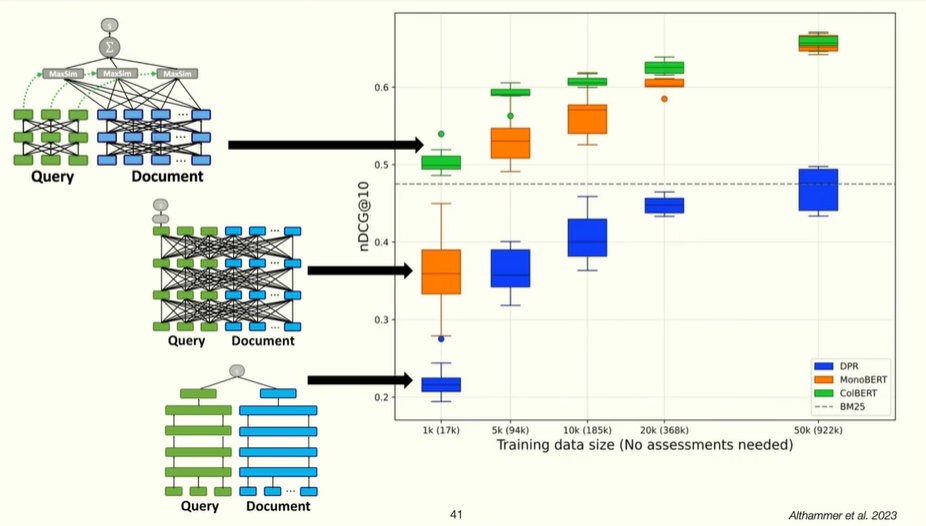

cross attention vs dual independent encoders - cross attention will fit prefectly

dual encoder is as good on training set, but worse on the test set.

blunt representations = blunt updates.
if you push it away from negative documents, it will be closer to other negative documents.

## Late interaction
cross attention not scalable, but has interaction
- 
single-vector dual-encoder very scalable, low. dot produit is a bottleneck

we still have independent encodings
but we have a sequence of small vectors (4 bytes each)
then do MAX similarity between small vectors

sublinear search, can do ANN but maximums can be shared across documents

max sim between each element of query and 

works best as found  in Althammer et al. 2023.

Comparison to dot-product approach:

more data, improves fast. 

Compositional updates - gradients flows through things that match (decommposed). 

## Key idea
weight Updates actually HELP other documents, instead of pushing it closer to other negative examples, since some tokens may be shared with other examples

Last Reviewed: 10/26/2025
