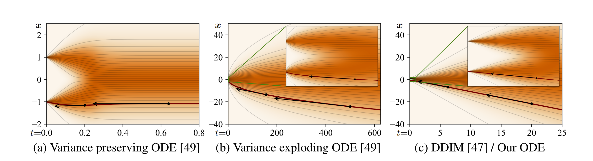

# EDM
## EDM's Formulation
Consider the family of distributions obtained by adding Gaussian noise of standard deviation $\sigma$ to the data distribution. Note that $\sigma$ is not restricted to being between $0$ and $1$, it can actually be very large.

Set a maximum noise level. The distribution of data plus noise at the maximum noise level is:

$$
p(\mathbf{x} ; \sigma_{max})
$$

This should be indistinguishable from pure Gaussian Noise, assuming $$\sigma_{max} >> \sigma_{data}$$. However, the values here may be quite large, which is to say that they are not samples from a *standard* Gaussian distribution, like they are in DDPM.

During the sampling process, we should start with a sample from
$
\mathbf{x}_0 \sim \mathcal{N}(\mathbf{0}, \sigma_{max}^2 \mathbf{I})
$, and denoise images sequentially such that we get $\mathbf{x}_1, \mathbf{x}_1, \ldots \mathbf{x}_N$, where

$$
\mathbf{x}_i \sim p(\mathbf{x}_i ; \sigma_i)
$$
And
$$
\sigma_{0} = \sigma_{max} > \sigma_1 > \cdots > \sigma_N = 0
$$

Then $\mathbf{x}_N$ is distributed like the data.

### ODE Version
In the ODE formulation, the only source of randomness in backwards sampling is the initial noise $\mathbf{x_0}$.

We want to specify $\sigma(t)$, or the desired noise level at time $t$. For instance, $\sigma(t) \propto \sqrt{t}$ is constant-speed heat diffusion.

The ODE, which represents both the backwards and forwards process, has the formula:

$$
d\mathbf{x} = - \dot \sigma(t) \sigma(t)\nabla_{\mathbf{x}} \log p \left( \mathbf{x}; \sigma(t) \right) dt
$$
To Do: Derive this.

Where we have the score function for the distribution at noise level $\sigma(t)$ in the formula. This ODE increases or decreases the noise level in the image.

## Score Function
If we have optimize a denoising function to our data at a certain noise level $\sigma$, then we have optimize this objective:

$$
\mathbb{E}_{\mathbf{y} \sim p_{data}} \mathbb{E}_{\mathbf{n} \sim \mathcal{N}(\mathbf{0}, \sigma^2 \mathbf{I})} \left| \left| D(\mathbf{y} + \mathbf{n}  ; \sigma ) - \mathbf{y} \right| \right|^2 _2
$$

This objective is analyzed more in [my notes on SDEs](Generative-Modeling-Using-SDEs.md). Then our score function will be equal to 

$$
\nabla \log_{\mathbf{x}} p \left( \mathbf{x}; \sigma(t) \right) = \left( D(\mathbf{x};\sigma) - \mathbf{x} \right) / \sigma^2
$$

Note that we can derive this by recognizing the that distribution of the noisy data is a mixture of Gaussians. To Do: Derive this.

Also note that $D$ may not be a neural network itself. It may have some pre and post-processing steps. For instance, in DDPM, we predict the noise instead of the denoised image.

## Scale functions
Some versions have $\mathbf{x} = s(t) \hat{\mathbf{x}}$, Where $\hat{\mathbf{x}}$ is the unscaled variable - which is still noisy.

Differentiating both sides and using the product rule, we get

$$\frac{d\mathbf{x}}{dt} = \dot s(t) \hat{\mathbf{x}} +  s(t) \frac{d\hat{\mathbf{x}}}{dt}$$

Or that 

$$\frac{d\mathbf{x}}{dt} = \dot s(t) \frac{\mathbf{x}}{s(t)} + s(t) \frac{d\hat{\mathbf{x}}}{dt} $$

$$\frac{d\mathbf{x}}{dt} = \frac{\dot s(t)}{s(t)} \mathbf{x} + s(t) \frac{d\hat{\mathbf{x}}}{dt}$$

$$d\mathbf{x} = \left[ \frac{\dot s(t)}{s(t)} \mathbf{x} + s(t) \frac{d\hat{\mathbf{x}}}{dt} \right]dt$$

$$d\mathbf{x} = \left[ \frac{\dot s(t)}{s(t)} \mathbf{x} + s(t) \left[ - \dot \sigma(t) \sigma(t)\nabla_{ \hat{\mathbf{x}}} \log p \left( \hat{\mathbf{x}}; \sigma(t) \right) \right] \right]dt$$

$$d\mathbf{x} = \left[ \frac{\dot s(t)}{s(t)} \mathbf{x} - s(t) \left[\dot \sigma(t) \sigma(t)\nabla_{ \hat{\mathbf{x}}} \log p \left( \hat{\mathbf{x}}; \sigma(t) \right) \right] \right]dt$$

Now we make a change of variables:

$$
d\mathbf{x} =  s(t) d\hat{\mathbf{x}}
$$

$$
\frac{d\mathbf{x}}{s(t)} =   d\hat{\mathbf{x}}
$$

$$
d\hat{\mathbf{x}} = \frac{d\mathbf{x}}{s(t)}
$$

$$
\frac{d}{d\hat{\mathbf{x}}} =   s(t) \frac{d}{d\mathbf{x}}
$$

$$
\nabla_{\hat{\mathbf{x}}} \log p(\hat{\mathbf{x}} ; \sigma(t)) =
\frac{d}{d\hat{\mathbf{x}}} \log p(\hat{\mathbf{x}}, \sigma(t)) = 
s(t) \frac{d}{d\mathbf{x}} \log p(\hat{\mathbf{x}}, \sigma(t))
$$

$$
= s(t) \frac{d}{d\mathbf{x}} \log p\left(\frac{\mathbf{x}}{s(t)}, \sigma(t)\right)
$$

$$
= s(t) \nabla_{\mathbf{x}} \log p\left(\frac{\mathbf{x}}{s(t)}, \sigma(t)\right)
$$

After substituting:

$$
d\mathbf{x} = \left[ \frac{\dot s(t)}{s(t)} \mathbf{x} - s(t) \left[\dot \sigma(t) \sigma(t)\nabla_{ \hat{\mathbf{x}}} \log p \left( \hat{\mathbf{x}}; \sigma(t) \right) \right] \right]dt
$$

$$
d\mathbf{x} = \left[ \frac{\dot s(t)}{s(t)} \mathbf{x} - s(t) \left[ \dot \sigma(t) \sigma(t) s(t) \nabla_{\mathbf{x}} \log p\left(\frac{\mathbf{x}}{s(t)}, \sigma(t)\right) \right] \right] dt
$$

$$
d\mathbf{x} = \left[ \frac{\dot s(t)}{s(t)} \mathbf{x} - s(t)^2 \left[ \dot \sigma(t) \sigma(t) \nabla_{\mathbf{x}} \log p\left(\frac{\mathbf{x}}{s(t)}, \sigma(t)\right) \right] \right] dt
$$

### Estimating the score function after scaling
Supposing we have a denoiser $D(\hat{\mathbf{x}} ; \sigma(t))$ for the unscaled variables $\hat{\mathbf{x}}$, then we have that 

$$
\nabla \log_{\hat{\mathbf{x}}} p \left( \hat{\mathbf{x}}; \sigma(t) \right) = \frac{ D(\hat{\mathbf{x}};\sigma) - \hat{\mathbf{x}} }{ \sigma(t)^2}
$$

We also have from above that

$$
\nabla \log_{\hat{\mathbf{x}}} p \left( \hat{\mathbf{x}}; \sigma(t) \right) = s(t) \nabla_{\mathbf{x}} \log p\left(\frac{\mathbf{x}}{s(t)}, \sigma(t)\right)
$$

Thus, 

$$
\nabla_{\mathbf{x}} \log p\left(\frac{\mathbf{x}}{s(t)}, \sigma(t)\right) = \frac{ D(\hat{\mathbf{x}};\sigma) - \hat{\mathbf{x}} }{\sigma(t)^2 s(t)}
= \frac{ D(\frac{\mathbf{x}}{s(t)};\sigma) - \frac{\mathbf{x}}{{s(t)}} }{\sigma(t)^2 s(t)}
$$

## Sampling
Theorectically, sampling should be independent from fitting $D$. $D$ is simply a black box.

Truncation error accumulates by discretizing time during sampling, but total truncation error decreases when the number of steps increases. In other words, local error scales super-linearly with respect to step size, so increasing step size by a factor of 2 increases per-step error by a factor of more than 2.

The Euler Method has error $O(h^2)$ with respect to the step size $h$. Huen's method has error $O(h^3)$.

Let us express the score function using the denoising function, whose input is $\hat{\mathbf{x}}$ and attempts to denoise it.

$$
d\mathbf{x} = \left[ \frac{\dot s(t)}{s(t)} \mathbf{x} - s(t)^2 \left[ \dot \sigma(t) \sigma(t) \nabla_{\mathbf{x}} \log p\left(\frac{\mathbf{x}}{s(t)}, \sigma(t)\right) \right] \right] dt
$$

$$
\frac{d\mathbf{x}}{dt} = \frac{\dot s(t)}{s(t)} \mathbf{x} - s(t)^2 \left[ \dot \sigma(t) \sigma(t) \nabla_{\mathbf{x}} \log p\left(\frac{\mathbf{x}}{s(t)}, \sigma(t)\right) \right]
$$

$$
\frac{d\mathbf{x}}{dt} = \frac{\dot s(t)}{s(t)} \mathbf{x} - s(t)^2 \left[ \dot \sigma(t) \sigma(t) \frac{ D(\frac{\mathbf{x}}{s(t)};\sigma) - \frac{\mathbf{x}}{{s(t)}} }{\sigma(t)^2 s(t)}
 \right]
$$

$$
\frac{d\mathbf{x}}{dt} =  \mathbf{x} \left( \frac{\dot s(t)}{s(t)}  - \frac{\dot \sigma(t)}{\sigma(t)} \right) - \frac{\dot \sigma(t) s(t)}{\sigma(t)}  D\left(\frac{\mathbf{x}}{s(t)}; \sigma(t) \right)
$$

We can use this derivative for the sampling algorithm.

### Huen's Method
- Use a second-order Huen sampler.
- This measures the derivative $\frac{d\mathbf{x}}{dt}$ at $\mathbf{x}$, and after taking one step.
- The actual derivative used is the average.
- When stepping to $\sigma = 0$, we revert to Euler to avoid dividing by zero.

Step size should decrease monotonically as noise level decreases, and does not need to depend on the sample.

To Do: Show the actual algorithm.

### Time Steps
The step sizes decrease as we get closer to no noise. In the paper we have $\rho = 7$, and that the step sizes are 

$$
\sigma_{i < N} = \left(\sigma_{max}^{1/\rho} + \frac{i}{N-1}\left(\sigma_{min}^{1/\rho} - \sigma_{max}^{1/\rho}\right) \right)^\rho
$$
In other words, we are doing linear interpolation in the $x^{1/\rho}$ domain. 

Note: I suppose this makes sense. Imagine the square root function, and taking points equally space on the $y$ axis. Linear spacing on the $y$ axis corresponds to more spacing on the $x$ axis as $x$ increases. The severity of this disparity depends on $\rho$. While $\rho = 3$ apparently nearly equalizes truncation error between steps, $\rho = 7$ works better, meaning that we want to make the disparity even more severe, or that the steps at lower noise levels matter more.

### Scale and Variance Schedule
Also, in the formuation:
- Set $s(t) = 1 $
- Set $\sigma(t) = t$

This means that $t$ and $\sigma$ become interchangeable. Also, since the noise trajectories are linear, we have that a single step to $t = 0$ will give you the denoised image. The tangent line to the trajectory points towards the denoiser output. The plots show you that we only have slight curvature at some intermediate time steps, but at the first and last time steps, we are linear.

### Stochastic Sampling

## Other Notes
- Use non-leaking augmentation - which is augmentation that does not change the data distribution.
## Single-Level

## Architectural Notes
First thing:
- 64x64 Conv

Block kwargs
- 512 embedding channels
- 1 head
- 0.1 dropout
- eps 1e-06
- xavier uniform initialization
- for attention blocks
    - sqrt(0.2) as init_weight
    - xavier uniform initialization

- for zero-initialized
    - 1e-5 init weight
- [1,1] resample filter
- resample projection is true
- skip scale is 1/sqrt(2)

UNet Block
- x = conv0(silu(norm0(x)))
- first norm is group norm with in_channels, 1e-6
- first conv has kernel size 3, potential upsampling/downsampling, xavier uniform initialization
- linear from emb_channels to out_channels
- x + linear(embedding)
- silu(norm2(x))
- dropout x
- conv1 x, conv2 has out, out, kernel size 3, 1e-5 initial weight
-  

Last Reviewed 2/11/25    