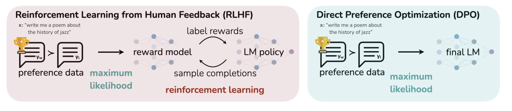

# EDM
## Paper Notes

Consider the family of distributions obtained by adding Gaussian noise of standard deviation $$\sigma$$ to the data distribution.

$$
p(\mathbf{x} ; \sigma_{max})
$$

Should be indistinguishable from pure Gaussian Noise, since $$\sigma_{max} >> \sigma_{data}$$.

After starting with 
$$
\mathbf{x}_0 \sim \mathcal{N}(\mathbf{0}, \sigma_{max}^2 \mathbf{I})
$$

We would like to denoise images sequentially such that 

$$
\mathbf{x}_i \sim p(\mathbf{x}_i ; \sigma_i)
$$

where

$$
\sigma_{0} = \sigma_{max} > \sigma_1 > \cdots > \sigma_N = 0
$$

Then $$\mathbf{x}_N$$ is distributed like the data.

### ODE
In the ODE formulation, the only source of randomness in backwards sampling is the initial noise $$\mathbf{x_0}$$.

We want to specify $$\sigma(t)$$, or the desired noise level at time $$t$$. For instance, $$\sigma(t) \propto \sqrt{t}$$ is constant-speed heat diffusion.

Actually, the backwards ODE has the formula:

$$
d\mathbf{x} = - \dot \sigma(t) \sigma(t)\nabla \log_{\mathbf{x}} p \left( \mathbf{x}; \sigma(t) \right)
$$

Where we have the score function at noise level $$\sigma(t)$$ in the formula.

## Score Function
If we have optimize a denoising function to our data at a certain noise level $$\sigma$$, then we have optimize this objective:

$$
\mathbb{E}_{\mathbf{y} \sim p_{data}} \mathbb{E}_{\mathbf{n} \sim \mathcal{N}(\mathbf{0}, \sigma^2 \mathbf{I})} \left| \left| D(\mathbf{y} + \mathbf{n}  ; \sigma ) - \mathbf{y} \right| \right|^2 _2
$$

Then our score function will be equal to 

$$
\nabla \log_{\mathbf{x}} p \left( \mathbf{x}; \sigma(t) \right) = \left( D(\mathbf{x};\sigma) - \mathbf{x} \right) / \sigma^2
$$

(Note that we can derive this by recognizing the that distribution of the noisy data is a mixture of Gaussians. In [my notes on SDEs](Generative-Modeling-Using-SDEs.md) we derived some of this).

Note that $$D$$ may not be a neural network itself;it may have some pre and post-processing steps. For instance, in DDPM, we predict the noise instead of the denoised image.

## Scale functions
Some versions have $$\mathbf{x} = s(t) \hat{\mathbf{x}}$$

Where $$\hat{\mathbf{x}}$$ is the original, unscaled variable. 

Differentiating both sides, and ignoring the product rule, we get

$$\frac{d\mathbf{x}}{dt} = \dot s(t) \hat{\mathbf{x}}$$

Or that 

$$\frac{d\mathbf{x}}{dt} = \dot s(t) \frac{\mathbf{x}}{s(t)}$$

$$\frac{d\mathbf{x}}{dt} = \frac{\dot s(t)}{s(t)} \mathbf{x}$$

$$d\mathbf{x} = \left[ \frac{\dot s(t)}{s(t)} \mathbf{x} \right]qdt$$

In such a case, the reverse-time ODE is

$$
d\mathbf{x} = \left[ \frac{\dot s(t)}{s(t)} \mathbf{x} - s(t)^2 \dot \sigma(t) \sigma(t)\nabla \log_\mathbf{x} p \left( \frac{\mathbf{x}}{s(t)} ; \sigma(t) \right) \right] dt
$$

Note: In our other notes, we had

$$
d\mathbf{x} = \left[f(\mathbf{x}, t) - \frac{1}{2} g^2(t)\nabla_\mathbf{x} \log p_t(\mathbf{x}_t) \right] dt
$$

as the reverse-time ODE, which is a generalization of this if we make the right substitutions.

## Sampling
Theorectically, sampling should be independent from fitting $D$. $D$ is simply a black box.

Truncation error accumulates by discretizing time during sampling, but total truncation error decreases when the number of steps increases. As in, local error scales super-linearly with respect to step size, so increasing step size by a factor of 2 increases error by a factor of more than 2.

### Huen's Method
- Use a second-order Huen sampler.
- This measures the derivative $$\frac{d\mathbf{x}}{dt} at \mathbf{x}, and after taking one step.
- The actual derivative used is the average.
- When stepping to $$\sigma = 0$$, we revert to Euler to avoid dividing by zero.

Step size should decrease monotonically as noise level decreases, and does not need to depend on the sample.

To Do: Derive the derivatives.

### Time Steps
The step sizes decrease as we get closer to no noise. In the paper we have $$\rho = 7$$, and that the step sizes are 

$$
\sigma_{i < N} = \left(\sigma_{max}^{1/\rho} + \frac{i}{N-1}\left(\sigma_{min}^{1/\rho} - \sigma_{max}^{1/\rho}\right) \right)^\rho
$$
In other words, we are doing linear interpolation in the $$x^{1/\rho}$$ domain. 

Note: I suppose this makes sense. Imagine the square root function, and taking points equally space on the $y$ axis. Linear spacing on the $y$ axis corresponds to more spacing on the $x$ axis as $x$ increases. The severity of this disparing depends on $\rho$. While $\rho = 3$ apparently nearly equalizes truncation error between steps, $\rho = 7$ works better, meaning that we want to make the disparity even more severe, or that the steps at lower noise levels matter more.

### Scale and Variance Schedule
Also, in the formuation:
- Set $$s(t) = 1 $$
- Set $$\sigma(t) = t$$

This means that $$t$$ and $$\sigma$$ become interchangeable.

Also, a single step to $$t = 0$$ will give you the denoised image, and the tangent line to the trajectory points towards the denoiser output. The plots show you that we only have slight curvature at some intermediate time steps, but at the first and last time steps, we are linear and point toward the mean of the data.

To Do: Think more about this.

### Stochastic Sampling

## Single-Level

## Architectural Notes
First thing:
- 64x64 Conv

Block kwargs
- 512 embedding channels
- 1 head
- 0.1 dropout
- eps 1e-06
- xavier uniform initialization
- for attention blocks
    - sqrt(0.2) as init_weight
    - xavier uniform initialization

- for zero-initialized
    - 1e-5 init weight
- [1,1] resample filter
- resample projection is true
- skip scale is 1/sqrt(2)

UNet Block
- x = conv0(silu(norm0(x)))
- first norm is group norm with in_channels, 1e-6
- first conv has kernel size 3, potential upsampling/downsampling, xavier uniform initialization
- linear from emb_channels to out_channels
- x + linear(embedding)
- silu(norm2(x))
- dropout x
- conv1 x, conv2 has out, out, kernel size 3, 1e-5 initial weight
-  

Last Reviewed 2/11/25    