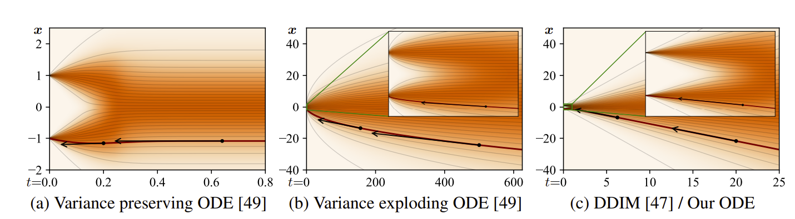

# Elucidated Diffusion Models

## Noisy Data Distributions
Let $p(\mathbf{y})$ denote the distribution of data examples $\mathbf{y}$.Consider the family of distributions obtained by adding Gaussian noise of standard deviation $\sigma$ to the data distribution. Note that $\sigma$ is not restricted to being between $0$ and $1$, and it can actually be very large.

We can denote the distribution of noisy data $\mathbf{x}$ at a noise level $\sigma$ to be

$$
p(\mathbf{x} ; \sigma)
$$

## ODE
Let us continue by writing an ODE, which can be used to transform data into noise (forward process) or noise into data (backward process) deterministically. The ODE will represent both of these processes. We introduce a time variable $t$, and imagine a datapoint $\mathbf{x}$ evolving as time changes. As $t$ increases, $\mathbf{x}$ gets noiser, and as $t$ decreases, $\mathbf{x}$ gets less noisy.

We can choose a function $\sigma(t)$ that is monotonically increasing. Then, formulate the ODE below:

$$
d\mathbf{x} = - \dot \sigma(t) \sigma(t)\nabla_{\mathbf{x}} \log p \left( \mathbf{x}; \sigma(t) \right) dt
$$

At time $t$, a datapoint $\mathbf{x}$ will be distributed according to $p(\mathbf{x} ; \sigma(t))$. Thus, $\sigma(t)$ is the desired noise level at time $t$, which is monotonically increasing. For instance, $\sigma(t) \propto \sqrt{t}$ is constant-speed heat diffusion. The formula includes the score function for the distribution at noise level $\sigma(t)$.

To Do: Derive the ODE.

Despite the fact that we are simulating the addition of noise, there is no randomness introduced into the forward or backwards process yet.

## Score Function
Suppose we have optimized a denoising function $D$ to our data at a certain noise level $\sigma$. The denoising function minimizes this objective:

$$
\mathbb{E}_{\mathbf{y} \sim p_{data}} \mathbb{E}_{\mathbf{n} \sim \mathcal{N}(\mathbf{0}, \sigma^2 \mathbf{I})} \left| \left| D(\mathbf{y} + \mathbf{n}  ; \sigma ) - \mathbf{y} \right| \right|^2 _2
$$

This objective is analyzed more in [my notes on SDEs](Generative-Modeling-Using-SDEs.md). Our score function will be equal to 

$$
\nabla \log_{\mathbf{x}} p \left( \mathbf{x}; \sigma(t) \right) = \left( D(\mathbf{x};\sigma) - \mathbf{x} \right) / \sigma^2
$$

Note that we can derive this by recognizing the that distribution of the noisy data is a mixture of Gaussians. 

To Do: Derive this, show that it is the score function for a single Gaussian, argue that it is linear.

$D$ may not be a neural network itself. It may have some pre and post-processing steps. For instance, in DDPM, we predict the noise instead of the denoised image.

## Scale functions
Some versions have $\mathbf{x} = s(t) \hat{\mathbf{x}}$, where $\hat{\mathbf{x}}$ is the unscaled variable (which can still be noisy). Let us try to derive the ODE when there is a scale function.

Differentiating both sides and using the product rule, we get

$$\frac{d\mathbf{x}}{dt} = \dot s(t) \hat{\mathbf{x}} +  s(t) \frac{d\hat{\mathbf{x}}}{dt}$$

Or that 

$$\frac{d\mathbf{x}}{dt} = \dot s(t) \frac{\mathbf{x}}{s(t)} + s(t) \frac{d\hat{\mathbf{x}}}{dt} $$

$$\frac{d\mathbf{x}}{dt} = \frac{\dot s(t)}{s(t)} \mathbf{x} + s(t) \frac{d\hat{\mathbf{x}}}{dt}$$

$$d\mathbf{x} = \left[ \frac{\dot s(t)}{s(t)} \mathbf{x} + s(t) d\hat{\mathbf{x}} \right]dt$$

Substituting our unscaled ODE for $\hat{\mathbf{x}}$:

$$d\mathbf{x} = \left[ \frac{\dot s(t)}{s(t)} \mathbf{x} + s(t) \left[ - \dot \sigma(t) \sigma(t)\nabla_{ \hat{\mathbf{x}}} \log p \left( \hat{\mathbf{x}}; \sigma(t) \right) \right] \right]dt$$

$$d\mathbf{x} = \left[ \frac{\dot s(t)}{s(t)} \mathbf{x} - s(t) \left[\dot \sigma(t) \sigma(t)\nabla_{ \hat{\mathbf{x}}} \log p \left( \hat{\mathbf{x}}; \sigma(t) \right) \right] \right]dt$$

Now we make a change of variables:

$$
d\mathbf{x} =  s(t) d\hat{\mathbf{x}}
$$

$$
\frac{d\mathbf{x}}{s(t)} =   d\hat{\mathbf{x}}
$$

$$
d\hat{\mathbf{x}} = \frac{d\mathbf{x}}{s(t)}
$$

$$
\frac{d}{d\hat{\mathbf{x}}} =   s(t) \frac{d}{d\mathbf{x}}
$$

$$
\nabla_{\hat{\mathbf{x}}} \log p(\hat{\mathbf{x}} ; \sigma(t)) =
\frac{d}{d\hat{\mathbf{x}}} \log p(\hat{\mathbf{x}}, \sigma(t)) = 
s(t) \frac{d}{d\mathbf{x}} \log p(\hat{\mathbf{x}}, \sigma(t))
$$

$$
= s(t) \frac{d}{d\mathbf{x}} \log p\left(\frac{\mathbf{x}}{s(t)}, \sigma(t)\right)
$$

$$
= s(t) \nabla_{\mathbf{x}} \log p\left(\frac{\mathbf{x}}{s(t)}, \sigma(t)\right)
$$

After substituting:

$$
d\mathbf{x} = \left[ \frac{\dot s(t)}{s(t)} \mathbf{x} - s(t) \left[\dot \sigma(t) \sigma(t)\nabla_{ \hat{\mathbf{x}}} \log p \left( \hat{\mathbf{x}}; \sigma(t) \right) \right] \right]dt
$$

$$
d\mathbf{x} = \left[ \frac{\dot s(t)}{s(t)} \mathbf{x} - s(t) \left[ \dot \sigma(t) \sigma(t) s(t) \nabla_{\mathbf{x}} \log p\left(\frac{\mathbf{x}}{s(t)}, \sigma(t)\right) \right] \right] dt
$$

$$
d\mathbf{x} = \left[ \frac{\dot s(t)}{s(t)} \mathbf{x} - s(t)^2 \left[ \dot \sigma(t) \sigma(t) \nabla_{\mathbf{x}} \log p\left(\frac{\mathbf{x}}{s(t)}, \sigma(t)\right) \right] \right] dt
$$

The formula above is our ODE when we have a scaling function.

### Estimating the score function after scaling
We would like to use our denoiser for the unscaled variable $\hat{\mathbf{x}}$ to estimate the score function, even when there is scaling. Supposing we have a denoiser $D(\hat{\mathbf{x}} ; \sigma(t))$ for the unscaled variable $\hat{\mathbf{x}}$, then we have that 

$$
\nabla \log_{\hat{\mathbf{x}}} p \left( \hat{\mathbf{x}}; \sigma(t) \right) = \frac{ D(\hat{\mathbf{x}};\sigma) - \hat{\mathbf{x}} }{ \sigma(t)^2}
$$

We also have from above that

$$
\nabla \log_{\hat{\mathbf{x}}} p \left( \hat{\mathbf{x}}; \sigma(t) \right) = s(t) \nabla_{\mathbf{x}} \log p\left(\frac{\mathbf{x}}{s(t)}, \sigma(t)\right)
$$

Thus, 

$$
\nabla_{\mathbf{x}} \log p \left( \frac{ \mathbf{x} }{ s(t) }, \sigma(t)\right) = \frac{ D( \hat{\mathbf{x} } ; \sigma) - \hat{ \mathbf{x} } }{\sigma(t)^2 s(t)}
= \frac{ D( \frac{ \mathbf{x} }{ s(t) } ; \sigma) - \frac{ \mathbf{x} }{s(t)} }{ \sigma(t)^2 s(t)}
$$

We can use this function to estimate the score function from the denoiser.

### Computing the Time-Derivative of x
In order to sample, we should compute the derivative $\frac{d\mathbf{x}}{dt}$. This can be used to estimate the denoising trajectory.

$$
\frac{ d \mathbf{x} }{ dt } = \frac{ \dot{s} (t) }{ s(t) } \mathbf{x} - s(t)^2 \left[ \dot{\sigma}(t) \sigma(t) \nabla_{\mathbf{x}} \log p \left( \frac{ \mathbf{x} }{ s(t) }, \sigma(t) \right) \right]
$$

$$
\frac{d \mathbf{x} }{ dt } = \frac{\dot{s}(t)}{s(t)} \mathbf{x} - s(t)^2 \left[ \dot \sigma(t) \sigma(t) \frac{ D( \frac{\mathbf{x}}{s(t)} ; \sigma) - \frac{\mathbf{x}}{{s(t)}} }{\sigma(t)^2 s(t)}
 \right]
$$

$$
\frac{d \mathbf{x} }{ dt } = \frac{\dot{s}(t)}{s(t)} \mathbf{x} - s(t)^2 \left[ \dot{\sigma}(t) \sigma(t) \frac{ D\left( \frac{\mathbf{x}}{s(t)} , \sigma \right) - \frac{\mathbf{x}}{s(t)} }{\sigma(t)^2 s(t)}
 \right]
$$

$$
\frac{d \mathbf{x} }{ dt } =  \mathbf{x} \left( \frac{\dot s(t)}{s(t)}  + \frac{\dot \sigma(t)}{\sigma(t)} \right) - \frac{\dot \sigma(t) s(t)}{\sigma(t)}  D\left(\frac{\mathbf{x}}{s(t)} ; \sigma(t) \right)
$$

We can use this derivative for sampling.

## Sampling

Set a maximum noise level. The distribution of noisy data at the maximum noise level is:

$$
p(\mathbf{x} ; \sigma_{max})
$$

This should be indistinguishable from pure Gaussian Noise, assuming $\sigma_{max} >> \sigma_{data}$. However, the values here may be quite large, which is to say that they are not samples from a *standard* Gaussian distribution, like they are in DDPM. 

**Side Note**: In fact, imposing the constraint that the largest noise level has variance 1 requires a curvature to the noise trajectory, which we do not want. This is because the score function is the derivative of the noise trajectory, which is a *linear* approximation. Thus, for this approximation to be maximally accurate, we should have *linear* noise trajectories.

During the sampling process, we should start with a sample from $$\mathbf{x}_{0} \sim \mathcal{N} ( \mathbf{0}, \sigma_{max}^2 \mathbf{I} )$$, and denoise images sequentially such that we get $\mathbf{x}_1, \mathbf{x}_1, \ldots \mathbf{x}_N$, where

$$
\mathbf{x}_i \sim p(\mathbf{x}_i ; \sigma_i)
$$
And
$$
\sigma_{0} = \sigma_{max} > \sigma_1 > \cdots > \sigma_N = 0
$$

Then, $\mathbf{x}_N$ will be distributed like the data.

**Notes:**
- In the ODE formulation, the only source of randomness in backwards sampling is the initial noise $\mathbf{x_0}$.
- Theorectically, sampling should be independent from fitting $D$. $D$ is simply a black box.

### Truncation Error
Truncation error accumulates by discretizing time during sampling, but total truncation error decreases when the number of steps increases. In other words, local error scales super-linearly with respect to step size, so increasing step size by a factor of 2 increases per-step error by a factor of more than 2, and thus increases error overall.

The Euler Method has error $O(h^2)$ with respect to the step size $h$. Huen's method has error $O(h^3)$.

### Huen's Method
- Use a second-order Huen sampler.
- This measures the derivative $\frac{d\mathbf{x}}{dt}$ at $\mathbf{x}$, and after taking one step.
- The actual derivative used is the average between these two derivatives.
- When stepping to $\sigma = 0$, we revert to Euler to avoid dividing by zero.

To Do: Show the actual algorithm.

### Spacing the Time Steps
Step size should decrease monotonically as noise level decreases, and does not need to depend on the content of the sample.

The step sizes decrease as we get closer to no noise. In the paper we have $\rho = 7$, and that the step sizes are 

$$
\sigma_{i < N} = \left(\sigma_{max}^{1/\rho} + \frac{i}{N-1}\left(\sigma_{min}^{1/\rho} - \sigma_{max}^{1/\rho}\right) \right)^\rho
$$
In other words, we are doing linear interpolation in the $x^{1/\rho}$ domain. 

**Note:** Imagine the square root function, and taking points equally space on the $y$ axis. Linear spacing on the $y$ axis corresponds to more spacing on the $x$ axis as $x$ increases. The severity of this disparity depends on $\rho$.

While $\rho = 3$ apparently nearly equalizes truncation error between steps, $\rho = 7$ works better, meaning that we want to make the disparity even more severe, or that the steps at lower noise levels matter more.

### Specific Scale and Variance Schedule
Also, in the EDM formulation, we have:
- Set $s(t) = 1 $
- Set $\sigma(t) = t$

This means that $t$ and $\sigma$ become interchangeable. Also, since the noise trajectories are linear, we have that a single step to $t = 0$ will give you the denoised image. The tangent line to the trajectory points towards the denoiser output. The plots show you that we only have slight curvature at some intermediate time steps, but at the first and last time steps, we are linear.

It should make sense that since the derivative is a linear approximation to the noise trajectory, the noise trajectory should be as linear as possible.

In addition, the formula for the derivative becomes much simpler:

$$
\frac{d\mathbf{x}}{dt} = \frac{\mathbf{x} - D(\mathbf{x}; t)}{t}
$$

## Stochastic Differential Equation
We can generalize our ODE to an SDE. Let's assume the parameters in the EDM formulation, $s(t) = 1$ and $\sigma(t) = t$.

$$
d\mathbf{x}_{\pm} = - \dot \sigma(t) \sigma(t) \nabla_{\mathbf{x}} \log p(\mathbf{x} ; \sigma(t)) dt \pm \beta(t) \sigma(t)^2 \nabla_{\mathbf{x}} \log p(\mathbf{x} ; \sigma(t)) dt + \sqrt{2 \beta(t)}\sigma(t) d \omega_t
$$

Note that we get Song's formulation when we have $\beta(t) = \dot \sigma(t)/\sigma(t)$, where the first two terms cancel out and there is no score in the forward process.

Also note that if $\beta(t)$ is zero, we have the non-stochastic ODE.

The three terms are, respectively:
1. Probability Flow ODE.
2. Deterministic Noise Decay.
3. Noise Injection.

**Notes**:
- Note that $dt$ is negative during the backwards process, meaning the second term goes towards the data distribution during denoising.
- During the denoising process, we can see term 2 as adding "more score" to the distribution, while the third time simultaneously adds "more noise".
- When we add these two terms together, the net contribution to the noise level cancels out.
- We can also think of the second term as removing more 'existing noise' and the third term as adding 'new noise'. $\beta$ (which scales up both the second and third terms) actually represents the degree to which new noise is replaced by existing noise.
- The second two terms help drive the sample towards the marginal distribution $p(\mathbf{x} ; \sigma(t))$, I suppose this is accomplished by adding more noise to keep the noise level the same, while also adding in some score.

To Do: Think more about the last bullet point.

### EDM's Sampler
This sampler includes churn, which adds and removes noise during the sampling process. At each step, we 
- Add noise to go from current noise level $t_i$ to a higher noise level $\hat{t}_i$
- Perform a single step from the higher noise level $$ \hat{t}_{i} $$ to the a new, even lower noise level $t_{i+1}$.

This is actually slightly different than approximating the SDE above. In the SDE above, we add noise, but we attempt to correct for it using the score function from the noise level $t_i$ *before* adding noiss. This is incorrect because the noise level that is input to the score fucntion is different than the actual noise level of the data. The EDM sampler uses the noise level $\hat{t}_i$ *after* adding noise. This is more accurate, and works better with larger step sizes.

We still can combine this with the second order Huen method.

#### Problems with Too Much Churn
- Too much churn can actually cause a loss of detail and drift towards oversaturated colors at low and high noise levels, possibly due to the fact that the score estimated by the denoiser network is a slightly non-conservative vector field.
- The true score function should ideally be conservative, meaning that integrating across a trajectory should be path-independent. However, adding noise might put you in a region of the vector field such that getting back to the same denoising trajectory isn't easy.
- This non-conservativity could be explained by the denoiser trying to remove too much noise, due to regression towards the mean.
- To Do: Think more about conservative vector fields.
- To Do: Think more about why denoisers remove too much noise, and regression toward the mean.

As a result, EDM does these modifications:
- We only churn within a range in the middle of the noise schedule. 
- When we choose the "churning noise", we should theoretically choose  $\epsilon \sim \mathcal{N}(\mathbf{0}, \mathbf{I})$, and then add $\sqrt{\hat{t}_i^2 - t_i^2} \epsilon$ to the sample.
- However, in practice we do $\epsilon \sim \mathcal{N}(\mathbf{0}, S^2_{noise} \mathbf{I})$, where $S^2_{noise} > 1$. This means we sample add a little more noise than we should, to counteract the bias in the denoiser to denoise too much.
- We define $S_{churn}$ as the "total" amount of churning, and choose $ \hat{t}_{i} = \gamma t_i$, where $\gamma = \min (\frac{S_{churn}}{N}, \sqrt{2} -1)$.

## EDM's Preconditioning
- Learning $D$ directly is difficult - the inputs vary greatly in terms of magnitude.
- Many works predict $\mathbf{n}$ scaled to unit variance - this keeps the output magnitudes consistent.
- However, for very high noise levels, this is difficult. The scale of the input is huge, and the denoised output is very small compared to it. We are basically relying on the noise estimate to cancel out with the input precisely such that their difference is on the same scale of the denoised data.
- Perhaps at high noise levels, it is actually easier to predict the denoised signal, so that we can consistently predict at the correct scale.
- Actually, our network predicts a mix of data and noise.

## Other Notes
### More Improvements
- Adjust Hyperparameters from previous work.
- Redistribute model capacity - remove lowest-resolution layers, double capacity of higher-resolution layers.
- Use their preconditioning.
- Use their loss function.
- Use non-leaking augmentation - which is augmentation that does not change the data distribution.

### Important Other Notes
- Using their preconditioning doesn't improve performance, but does make training more robust.
- For the best models on CIFAR-10, any amount of stochasticity is bad. But, for more diverse datasets, we benefit.
- Maybe the effect of changing the preconditioning is dubious, it seems to give worse results in many cases.

## Single-Level

## Architectural Notes
First thing:
- 64x64 Conv

Block kwargs
- 512 embedding channels
- 1 head
- 0.1 dropout
- eps 1e-06
- xavier uniform initialization
- for attention blocks
    - sqrt(0.2) as init_weight
    - xavier uniform initialization

- for zero-initialized
    - 1e-5 init weight
- [1,1] resample filter
- resample projection is true
- skip scale is 1/sqrt(2)

UNet Block
- x = conv0(silu(norm0(x)))
- first norm is group norm with in_channels, 1e-6
- first conv has kernel size 3, potential upsampling/downsampling, xavier uniform initialization
- linear from emb_channels to out_channels
- x + linear(embedding)
- silu(norm2(x))
- dropout x
- conv1 x, conv2 has out, out, kernel size 3, 1e-5 initial weight
-  

Last Reviewed 2/11/25    